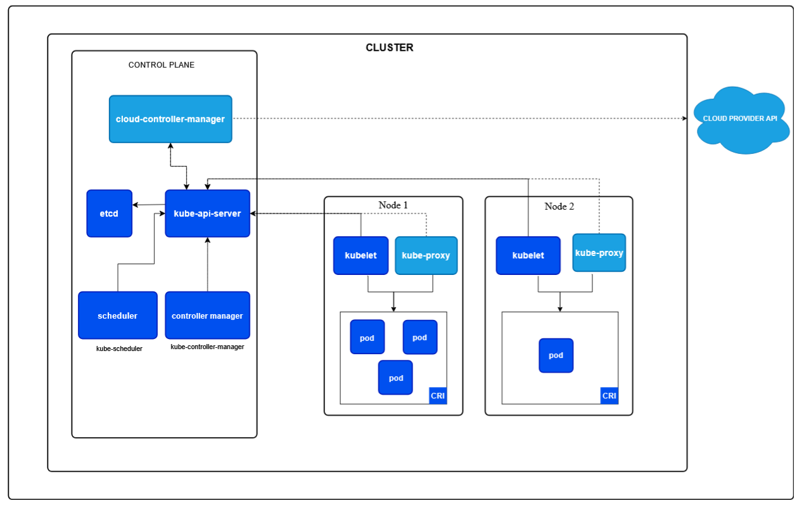

# Kubernetes Architecture

## Overview
Kubernetes is a container orchestration platform that manages containerized applications across a cluster of machines. It provides automated deployment, scaling, and management of containerized workloads.

---

## Cluster Architecture

A Kubernetes cluster consists of a **Control Plane** (Master) and multiple **Worker Nodes**.
#### Cluster Diagram 

---

## Control Plane Components

The Control Plane manages the state of the cluster and makes global decisions.

### 1. **API Server** (`kube-apiserver`)
- **Purpose**: Central management point for the cluster
- **Functions**:
  - Exposes the Kubernetes API (REST API)
  - Processes and validates API requests
  - Manages cluster state
  - Authenticates and authorizes requests
  - Acts as the gatekeeper for the cluster

### 2. **etcd** (Distributed Key-Value Store)
- **Purpose**: Persistent data store for the cluster
- **Functions**:
  - Stores all cluster data (configurations, state, secrets)
  - Provides strong consistency guarantees
  - Distributed and highly available
  - Supports watch operations for real-time updates

### 3. **Scheduler** (`kube-scheduler`)
- **Purpose**: Assigns pods to nodes
- **Functions**:
  - Watches for newly created, unscheduled pods
  - Evaluates resource requirements and constraints
  - Places pods on suitable nodes
  - Considers node affinity, taints, tolerations, and resource availability

### 4. **Controller Manager** (`kube-controller-manager`)
- **Purpose**: Runs controller processes
- **Key Controllers**:
  - **Node Controller**: Manages node lifecycle and status
  - **Replication Controller**: Manages pod replicas
  - **Endpoints Controller**: Creates endpoints for services
  - **Service Account & Token Controllers**: Create default accounts and API access tokens
  - **Deployment Controller**: Manages deployments
  - **StatefulSet Controller**: Manages stateful applications
  - **DaemonSet Controller**: Ensures pods run on all/selected nodes

### 5. **Cloud Controller Manager** (Optional)
- **Purpose**: Integrates cloud-provider-specific logic
- **Functions**:
  - Node controller: Check cloud provider for node termination
  - Route controller: Set up routes in cloud infrastructure
  - Service controller: Provision cloud load balancers
  - Volume controller: Create, attach, mount volumes

---

## Worker Node Components

Worker Nodes run containerized applications (pods) and report to the control plane.

### 1. **Kubelet**
- **Purpose**: Node agent that ensures containers run in pods
- **Functions**:
  - Watches for pod assignments from API Server
  - Mounts pod volumes and downloads secrets
  - Runs pod containers via container runtime
  - Reports node and pod status to API Server
  - Performs liveness and readiness probes

### 2. **Container Runtime**
- **Purpose**: Pulls and runs containers
- **Supported Options**:
  - Docker
  - containerd
  - CRI-O
  - rktlet
- **Functions**:
  - Pulls container images from registries
  - Manages container lifecycle
  - Allocates container resources

### 3. **kube-proxy**
- **Purpose**: Network proxy for pod communication
- **Functions**:
  - Maintains network rules on nodes
  - Enables service-to-pod communication
  - Implements port forwarding
  - Load balances traffic to pods
  - Supports multiple proxy modes: iptables, ipvs, userspace

### 4. **Pods**
- **Purpose**: Smallest deployable unit in Kubernetes
- **Characteristics**:
  - Can contain one or more containers (usually one)
  - Containers in a pod share network namespace (IP address)
  - Share storage volumes
  - Short-lived and ephemeral

---

## Key Concepts

### Namespaces
- Virtual clusters for isolation
- Default, kube-system, kube-node-lease, kube-public

### Services
- Abstracts access to pods
- Types: ClusterIP, NodePort, LoadBalancer, ExternalName

### Deployments
- Declarative updates for pods and replicas
- Manages replica sets

### ConfigMaps & Secrets
- ConfigMaps: Store non-sensitive configuration
- Secrets: Store sensitive data (passwords, tokens, keys)

### Volumes
- Persistent storage for pods
- Types: emptyDir, hostPath, nfs, persistentVolumeClaim, etc.

### Labels & Selectors
- Key-value pairs for identifying and organizing objects
- Used for service discovery and scaling

---

## Communication Flow

```
User/Client
    ↓
kubectl / API Client
    ↓
API Server (authenticate, authorize, validate)
    ↓
etcd (store/retrieve state)
    ↓
Controllers / Scheduler
    ↓
Kubelet (on nodes)
    ↓
Container Runtime
    ↓
Containers (Pods)
```

---

## Cluster Network

- **Pod Network**: Communication between pods across nodes
- **Service Network**: Virtual IPs for service discovery
- **Node Network**: Communication between nodes

---

## High Availability

- Multiple Control Plane replicas (HA Master)
- Multiple etcd instances
- Multiple Worker Nodes
- Load balancers for API Server access

---


